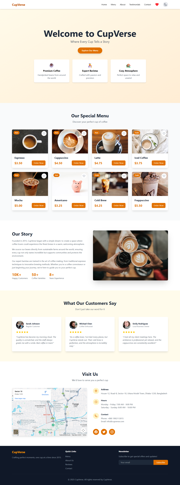

# CupVerse - Coffee Shop Landing Page

A modern, fully responsive landing page for a coffee shop built with React.js, Redux Toolkit, and Tailwind CSS v4.1 (Vite Plugin).

## Live Demo

[Click Here](https://coffee-shop-landing-page-sigma.vercel.app/)

## Screenshot
 



## Features List

1. **Fully Responsive Design**: Perfect on mobile, tablet, and desktop
2. **Dark/Light Theme Toggle**: Smooth transitions with localStorage persistence
3. **Favorites System**: Add menu items to favorites with heart icon
4. **Redux State Management**: Theme and favorites managed with Redux Toolkit
5. **Smooth Animations**: Fade-ins, hover effects, and smooth scrolling
6. **Interactive Navigation**: Hamburger menu for mobile devices
7. **Modern UI**: Clean design with Tailwind CSS v4.1

## Sections

1. **Hero Section**: Welcome banner with coffee shop tagline
2. **Menu Section**: 8 coffee items with images, names, prices, and favorites
3. **About Us**: Coffee shop story and statistics
4. **Testimonials**: 3 customer reviews with ratings
5. **Contact**: Google Maps embed, business hours, and contact info
6. **Footer**: Newsletter signup and social media links

## Technologies Used

- **React.js** v19.2.0 (Functional Components + Hooks)
- **Redux Toolkit** v2.10.1 (State Management)
- **Tailwind CSS** v4.1.17 (Vite Plugin - No config file needed)
- **Vite** v7.2.2 (Build Tool)

## Installation & Run Locally

### Step 1: Clone the Repository

```bash
git clone https://github.com/pranto113015/Coffee-Shop-Landing-Page.git

```

### Step 2: Install Dependencies

```bash
npm install
```

### Step 3: Run Development Server

```bash
npm run dev
```

### Step 4: Open in Browser This URL

```
http://localhost:5173
```

## Project Structure

```
src/
├── components/
│   ├── Header.jsx          # Navigation, favorites counter, theme toggle
│   ├── Hero.jsx            # Hero section with CTA
│   ├── MenuCard.jsx        # Individual menu item card
│   ├── MenuSection.jsx     # Menu grid with all items
│   ├── About.jsx           # About section
│   ├── Testimonials.jsx    # Customer reviews
│   ├── Contact.jsx         # Contact info and map
│   └── Footer.jsx          # Footer section
├── redux/
│   ├── themeSlice.js       # Theme state (light/dark)
│   ├── favoritesSlice.js   # Favorites state
│   └── store.js            # Redux store configuration
├── App.jsx                 # Main app component
├── main.jsx                # Entry point with Redux Provider
└── index.css               # Tailwind CSS v4.1 import
```

## Design Features

- **Color Scheme**: Amber/Orange primary colors
- **Dark Mode**: Gray scale with amber accents
- **Animations**: Custom fade-in and slide animations
- **Images**: High-quality photos from Unsplash

## Build for Production

```bash
npm run build
```

Production files will be generated in the `dist/` folder.

## Features Checklist

1. React functional components
2. Redux Toolkit (theme + favorites)
3. Tailwind CSS v4.1 Vite Plugin (no config file)
4. LocalStorage persistence
5. Light/Dark theme toggle
6. Favorites counter in header
7. Smooth scroll navigation
8. Hamburger menu for mobile
9. 8 menu items with images
10. All required sections
11. Fully responsive


## Developer Information

**Name**: Pranto Kumar  
**Email**: pranto113015@gmail.com  
**Submission Date**: 17-Nov-2025

## License

This project was created as part of a Frontend Developer Intern assignment.
